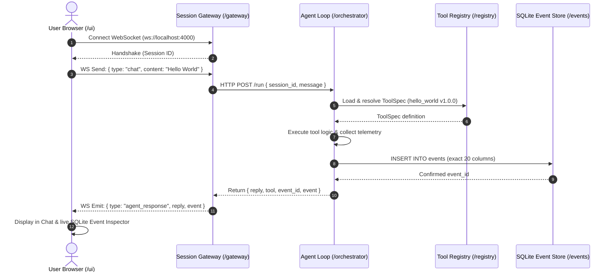

# Autonomous Agent Monorepo

Modular monorepo architecture for an autonomous agent platform with decoupled service boundaries.

```
.
├── /ui           # Next.js + React chat interface & SQLite Event Inspector
├── /gateway      # TypeScript session gateway (WebSocket & HTTP server)
├── /orchestrator # Agent loop (Python/FastAPI, designed for hardening to Rust)
├── /registry     # YAML ToolSpec definitions & multi-language loaders
└── /events       # SQLite event store with strict 20-field Event schema
```

---

## Architecture & Service Boundary Flow



---

## Directory Overview

### 1. `/ui` (Next.js + React)
- **Framework**: Next.js 16 (App Router), React, Vanilla CSS custom tokens
- **Features**:
  - Live WebSocket client connected to `/gateway`
  - Real-time connection status pill (Connected, Connecting, Disconnected)
  - Interactive chat interface with quick action triggers ("Verify Boundary", "Ping System")
  - Live SQLite Event Inspector showing the exact 20 columns written for each step
- **Port**: `3000`

### 2. `/gateway` (TypeScript WebSocket Gateway)
- **Runtime**: Node.js + TypeScript (`ws`, `tsx`)
- **Features**:
  - Client connection management and session allocation (`sessionId`)
  - Translates WebSocket chat payloads to HTTP RPC calls for the Orchestrator
  - Streams back execution status and confirmed database events
- **Port**: `4000`

### 3. `/orchestrator` (Agent Loop & Process Supervisor)
- **Framework**: Python 3 / FastAPI / Uvicorn
- **Features**:
  - Agent loop execution and task orchestration
  - **`shell.run.v1` Execution Adapter**: Hardcoded adapter taking command and string args list, executed via [orchestrator/process_supervisor.py](file:///c:/New%20Volume%20%28D%29/dev/orchestrator/process_supervisor.py).
  - **Hard Timeout**: Forcibly kills runaway processes exceeding timeout budget.
  - **Kill Switch**: `POST /kill` and `POST /kill/{task_id}` to issue immediate `SIGKILL` to running processes by `task_id`.
  - Telemetry capture (child process ID, start/end timestamps, stdout/stderr refs, exit code).
  - Writes directly to `/events/events.db` conforming strictly to the 20-field schema.
- **Port**: `8000`

### 4. `/registry` (ToolSpec Definitions & Loaders)
- **Format**: Declarative YAML tool specifications
- **Includes**:
  - `shell_run_v1.yaml`: Execution adapter spec with command, args, and timeout
  - `hello_world.yaml`: Minimal boundary verification tool
  - `system_ping.yaml`: System diagnostic tool
  - `loader.py`: Python loader and validator
  - `loader.ts`: TypeScript loader

### 5. `/events` (SQLite Event Store)
- **Storage**: `events/events.db` initialized from `events/schema.sql`
- **Schema Columns**:
  1. `session_id`: TEXT
  2. `task_id`: TEXT
  3. `timestamp`: TEXT
  4. `actor`: TEXT
  5. `tool_id`: TEXT
  6. `tool_version`: TEXT
  7. `requested_args`: TEXT (JSON)
  8. `normalized_args`: TEXT (JSON)
  9. `process_id`: INTEGER
  10. `start_time`: TEXT
  11. `end_time`: TEXT
  12. `exit_code`: INTEGER
  13. `stdout_ref`: TEXT
  14. `stderr_ref`: TEXT
  15. `artifact_refs`: TEXT (JSON)
  16. `screenshots`: TEXT (JSON)
  17. `network_context`: TEXT (JSON)
  18. `result_summary`: TEXT
  19. `confidence`: REAL
  20. `parent_event`: TEXT

---

## Local Model Plumbing (`llama.cpp` Server Mode)

The Orchestrator wires to a local LLM running in `llama-server` mode with GBNF grammar-constrained generation:

1. **Grammar & Schema Constraint**:
   - Uses `build_tool_call_json_schema` from [orchestrator/schema_gen.py](file:///c:/New%20Volume%20%28D%29/dev/orchestrator/schema_gen.py).
   - Constrains output structurally to either:
     - `action: "message"` with plain text `content`
     - `action: "tool_call"` with `tool_id` (strictly constrained to registered tools) and `arguments`.
   - Constrained at the token sampling level by `llama.cpp`'s internal GBNF grammar converter, making malformed outputs structurally impossible.

2. **Model Swapping**:
   - Initialized with quantized `Qwen2.5-0.5B-Instruct-Q4_K_M.gguf` for sub-500ms plumbing verification.
   - Configured with `Qwen3-Coder-30B-A3B-Instruct` (MoE 30B, 3.3B active parameters) for production coding and fallback verification model.

3. **Model Center & Runtime Configuration (`models.yaml`)**:
   - Model config file ([models.yaml](file:///c:/New%20Volume%20%28D%29/dev/models.yaml)) tracks:
     - `model_id`: `Qwen3-Coder-30B-A3B-Instruct` (Primary) & `Qwen2.5-0.5B-Instruct` (Fallback)
     - `runtime`: `llama.cpp`
     - `quantization`: `Q4_K_M`
     - `context_length`: `32768` tokens (32K)
     - `role`: `fallback` / `primary`
   - Real-time status endpoint `/model-center` (orchestrator + gateway proxy) reporting:
     - Currently loaded model and active role
     - Context limit (tokens)
     - GPU VRAM metrics (`total_mb`, `used_mb`, `free_mb`, `utilization_pct`) via `nvidia-smi`
     - Host system RAM metrics via Windows `GlobalMemoryStatusEx`
     - Model catalog definitions
   - Next.js Phase 4 Model Manager UI panel displaying live telemetry gauges, active model cards, and catalog.

---

## Quickstart

### Automated End-to-End Verification Tests

1. **Verify Model Center & Telemetry**:

   ```bash
   python test_model_center.py
   ```

2. **Verify Full Monorepo Boundary**:

   ```bash
   python test_boundary.py
   ```

### Running Services Manually

#### Terminal 1: Llama Server (Local Model)

```bash
llama-server -m models/qwen2.5-0.5b-instruct-q4_k_m.gguf --host 127.0.0.1 --port 8080 -c 2048 -ngl 99
```

#### Terminal 2: Orchestrator

```bash
python -m uvicorn orchestrator.server:app --host 127.0.0.1 --port 8000
```

#### Terminal 3: Session Gateway

```bash
cd gateway
npm run dev
```

#### Terminal 4: UI

```bash
cd ui
npm run dev
```

Open [http://localhost:3000](http://localhost:3000) in your browser.
