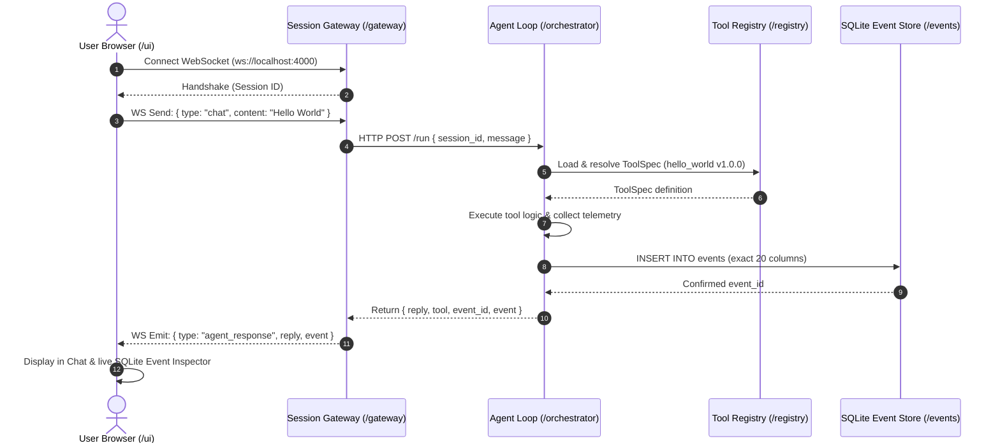

# Autonomous Agent Monorepo

Modular monorepo architecture for an autonomous agent platform with decoupled service boundaries.

```
.
├── /ui           # Next.js + React chat interface & SQLite Event Inspector
├── /gateway      # TypeScript session gateway (WebSocket & HTTP server)
├── /orchestrator # Agent loop (Python/FastAPI, designed for hardening to Rust)
├── /registry     # YAML ToolSpec definitions & multi-language loaders
└── /events       # SQLite event store with strict 20-field Event schema
```

---

## Architecture & Service Boundary Flow



---

## Directory Overview

### 1. `/ui` (Next.js + React)
- **Framework**: Next.js 16 (App Router), React, Vanilla CSS custom tokens
- **Features**:
  - Live WebSocket client connected to `/gateway`
  - Real-time connection status pill (Connected, Connecting, Disconnected)
  - Interactive chat interface with quick action triggers ("Verify Boundary", "Ping System")
  - Live SQLite Event Inspector showing the exact 20 columns written for each step
- **Port**: `3000`

### 2. `/gateway` (TypeScript WebSocket Gateway)
- **Runtime**: Node.js + TypeScript (`ws`, `tsx`)
- **Features**:
  - Client connection management and session allocation (`sessionId`)
  - Translates WebSocket chat payloads to HTTP RPC calls for the Orchestrator
  - Streams back execution status and confirmed database events
- **Port**: `4000`

### 3. `/orchestrator` (Agent Loop - Python)
- **Framework**: Python 3 / FastAPI / Uvicorn
- **Features**:
  - Agent loop execution and task orchestration
  - Loads tool specifications from `/registry`
  - Telemetry capture (process ID, execution timing, stdout/stderr refs, args)
  - Writes directly to `/events/events.db` conforming strictly to the 20-field schema
  - *Hardening path*: Easily replaceable with Rust (`axum` + `rusqlite` + `serde_yaml`)
- **Port**: `8000`

### 4. `/registry` (ToolSpec Definitions & Loaders)
- **Format**: Declarative YAML tool specifications
- **Includes**:
  - `hello_world.yaml`: Minimal boundary verification tool
  - `system_ping.yaml`: System diagnostic tool
  - `loader.py`: Python loader and validator
  - `loader.ts`: TypeScript loader

### 5. `/events` (SQLite Event Store)
- **Storage**: `events/events.db` initialized from `events/schema.sql`
- **Schema Columns**:
  1. `session_id`: TEXT
  2. `task_id`: TEXT
  3. `timestamp`: TEXT
  4. `actor`: TEXT
  5. `tool_id`: TEXT
  6. `tool_version`: TEXT
  7. `requested_args`: TEXT (JSON)
  8. `normalized_args`: TEXT (JSON)
  9. `process_id`: INTEGER
  10. `start_time`: TEXT
  11. `end_time`: TEXT
  12. `exit_code`: INTEGER
  13. `stdout_ref`: TEXT
  14. `stderr_ref`: TEXT
  15. `artifact_refs`: TEXT (JSON)
  16. `screenshots`: TEXT (JSON)
  17. `network_context`: TEXT (JSON)
  18. `result_summary`: TEXT
  19. `confidence`: REAL
  20. `parent_event`: TEXT

---

## Quickstart

### Automated End-to-End Verification Test
Run the automated test script to launch services, dispatch a WebSocket message, write an event, and verify the SQLite schema:
```bash
python test_boundary.py
```

### Running Services Manually

#### Terminal 1: Orchestrator
```bash
python -m uvicorn orchestrator.server:app --host 127.0.0.1 --port 8000
```

#### Terminal 2: Session Gateway
```bash
cd gateway
npm run dev
```

#### Terminal 3: UI
```bash
cd ui
npm run dev
```
Open [http://localhost:3000](http://localhost:3000) in your browser.
