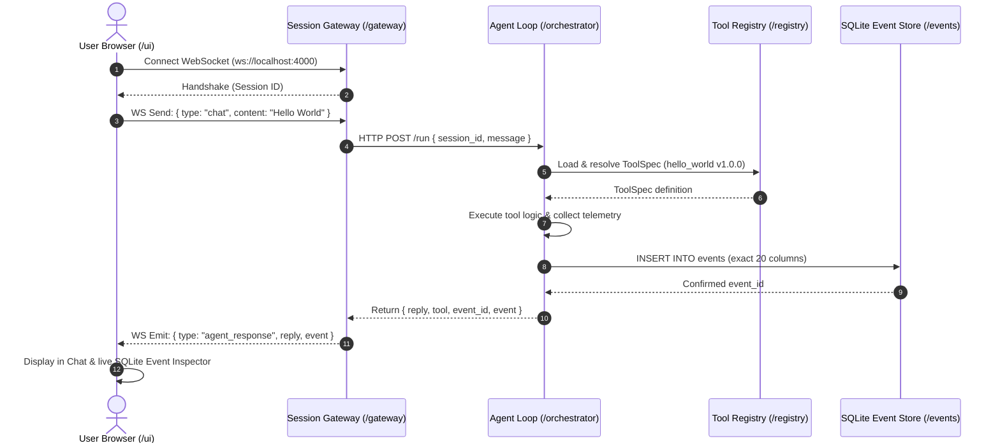

# Autonomous Agent Monorepo

Modular monorepo architecture for an autonomous agent platform with decoupled service boundaries.

```
.
├── /ui           # Next.js + React chat interface & SQLite Event Inspector
├── /gateway      # TypeScript session gateway (WebSocket & HTTP server)
├── /orchestrator # Agent loop (Python/FastAPI, designed for hardening to Rust)
├── /registry     # YAML ToolSpec definitions & multi-language loaders
└── /events       # SQLite event store with strict 20-field Event schema
```

---

## Architecture & Service Boundary Flow



---

## Directory Overview

### 1. `/ui` (Next.js + React)
- **Framework**: Next.js 16 (App Router), React, Vanilla CSS custom tokens
- **Features**:
  - Live WebSocket client connected to `/gateway`
  - Real-time connection status pill (Connected, Connecting, Disconnected)
  - Interactive chat interface with quick action triggers ("Verify Boundary", "Ping System")
  - Live SQLite Event Inspector showing the exact 20 columns written for each step
- **Port**: `3000`

### 2. `/gateway` (TypeScript WebSocket Gateway)
- **Runtime**: Node.js + TypeScript (`ws`, `tsx`)
- **Features**:
  - Client connection management and session allocation (`sessionId`)
  - Translates WebSocket chat payloads to HTTP RPC calls for the Orchestrator
  - Streams back execution status and confirmed database events
- **Port**: `4000`

### 3. `/orchestrator` (Agent Loop & Process Supervisor)
- **Framework**: Python 3 / FastAPI / Uvicorn
- **Features**:
  - Agent loop execution and task orchestration
  - **`shell.run.v1` Execution Adapter**: Hardcoded adapter taking command and string args list, executed via [orchestrator/process_supervisor.py](file:///c:/New%20Volume%20%28D%29/dev/orchestrator/process_supervisor.py).
  - **Hard Timeout**: Forcibly kills runaway processes exceeding timeout budget.
  - **Kill Switch**: `POST /kill` and `POST /kill/{task_id}` to issue immediate `SIGKILL` to running processes by `task_id`.
  - Telemetry capture (child process ID, start/end timestamps, stdout/stderr refs, exit code).
  - Writes directly to `/events/events.db` conforming strictly to the 20-field schema.
- **Port**: `8000`

### 4. `/registry` (ToolSpec Definitions & Loaders)
- **Format**: Declarative YAML tool specifications
- **Includes**:
  - `shell_run_v1.yaml`: Execution adapter spec with command, args, and timeout
  - `hello_world.yaml`: Minimal boundary verification tool
  - `system_ping.yaml`: System diagnostic tool
  - `loader.py`: Python loader and validator
  - `loader.ts`: TypeScript loader

### 5. `/events` (SQLite Event Store)
- **Storage**: `events/events.db` initialized from `events/schema.sql`
- **Schema Columns**:
  1. `session_id`: TEXT
  2. `task_id`: TEXT
  3. `timestamp`: TEXT
  4. `actor`: TEXT
  5. `tool_id`: TEXT
  6. `tool_version`: TEXT
  7. `requested_args`: TEXT (JSON)
  8. `normalized_args`: TEXT (JSON)
  9. `process_id`: INTEGER
  10. `start_time`: TEXT
  11. `end_time`: TEXT
  12. `exit_code`: INTEGER
  13. `stdout_ref`: TEXT
  14. `stderr_ref`: TEXT
  15. `artifact_refs`: TEXT (JSON)
  16. `screenshots`: TEXT (JSON)
  17. `network_context`: TEXT (JSON)
  18. `result_summary`: TEXT
  19. `confidence`: REAL
  20. `parent_event`: TEXT

---

## Local Model Plumbing (`llama.cpp` Server Mode)

The Orchestrator wires to a local LLM running in `llama-server` mode with GBNF grammar-constrained generation:

1. **Grammar & Schema Constraint**:
   - Uses `build_tool_call_json_schema` from [orchestrator/schema_gen.py](file:///c:/New%20Volume%20%28D%29/dev/orchestrator/schema_gen.py).
   - Constrains output structurally to either:
     - `action: "message"` with plain text `content`
     - `action: "tool_call"` with `tool_id` (strictly constrained to registered tools) and `arguments`.
   - Constrained at the token sampling level by `llama.cpp`'s internal GBNF grammar converter, making malformed outputs structurally impossible.

2. **Model Swapping**:
   - Initialized with quantized `Qwen2.5-0.5B-Instruct-Q4_K_M.gguf` for sub-500ms plumbing verification.
   - Configured with `Qwen3-Coder-30B-A3B-Instruct` (MoE 30B, 3.3B active parameters) for production coding and fallback verification model.

3. **Model Center & Runtime Configuration (`models.yaml`)**:
   - Model config file ([models.yaml](file:///c:/New%20Volume%20%28D%29/dev/models.yaml)) tracks:
     - `model_id`: `Qwen3-Coder-30B-A3B-Instruct` (Primary) & `Qwen2.5-0.5B-Instruct` (Fallback)
     - `runtime`: `llama.cpp`
     - `quantization`: `Q4_K_M`
     - `context_length`: `32768` tokens (32K)
     - `role`: `fallback` / `primary`
   - Real-time status endpoint `/model-center` (orchestrator + gateway proxy) reporting:
     - Currently loaded model and active role
     - Context limit (tokens)
     - GPU VRAM metrics (`total_mb`, `used_mb`, `free_mb`, `utilization_pct`) via `nvidia-smi`
     - Host system RAM metrics via Windows `GlobalMemoryStatusEx`
     - Model catalog definitions
   - Next.js Phase 4 Model Manager UI panel displaying live telemetry gauges, active model cards, and catalog.

---

## Quickstart

### Automated End-to-End Verification Tests

1. **Verify Model Center & Telemetry**:

   ```bash
   python test_model_center.py
   ```

2. **Verify Full Monorepo Boundary**:

   ```bash
   python test_boundary.py
   ```

### Running Services Manually

#### Terminal 1: Llama Server (Local Model)

```bash
llama-server -m models/qwen2.5-0.5b-instruct-q4_k_m.gguf --host 127.0.0.1 --port 8080 -c 2048 -ngl 99
```

#### Terminal 2: Orchestrator

```bash
python -m uvicorn orchestrator.server:app --host 127.0.0.1 --port 8000
```

#### Terminal 3: Session Gateway

```bash
cd gateway
npm run dev
```

#### Terminal 4: UI

```bash
cd ui
npm run dev
```

Open [http://localhost:3000](http://localhost:3000) in your browser.

---

## Task 1.1 & 1.2: Isolated Kali Linux VM Sandbox & Snapshot Lifecycle

### Architecture Overview

```text
Host (Windows)                              Kali Linux Guest VM (VirtualBox / NAT)
┌───────────────────────────────┐           ┌─────────────────────────────────────┐
│ UI (Next.js / VM Sandbox Tab) │           │ systemd (kairo-worker.service)      │
│   ├── Live Status & Health    │           │   ├── /opt/kairo/worker_agent.py    │
│   ├── Snapshot Inventory      │           │   │   ├── GET  /health              │
│   └── 1-Click Manual Rollback │           │   │   ├── POST /execute (ToolSpec)  │
│                               │           │   │   └── POST /kill/<task_id>      │
│ Gateway (Port 4000)           │           │   └── Guest Port 9999               │
│   ├── Proxy /vm/* Endpoints   │           │                                     │
│   └── WS Event Handlers       │           │ sshd (Port 22, root enabled)        │
│                               │           └──────────────────▲──────────────────┘
│ Orchestrator (Port 8000)      │                              │
│   ├── VMManager (VBoxManage)  │ NAT Port Forwarding:         │
│   │   ├── take_snapshot()     │   Host 127.0.0.1:9999 ───────┤ (Worker Agent)
│   │   ├── rollback_snapshot() │   Host 127.0.0.1:2222 ───────┘ (SSH Access)
│   │   └── execute_in_vm()     │
│   └── SQLite Event Store      │
└───────────────────────────────┘
```

### Key Features Implemented

1. **Isolated Kali Linux Guest VM**:
   - Running VirtualBox VM (`kali-linux-2026.1-virtualbox-amd64`) in headless mode.
   - NAT Port forwarding configured:
     - `127.0.0.1:2222` ➔ Guest `22` (SSH with key/password authentication)
     - `127.0.0.1:9999` ➔ Guest `9999` (Worker Agent HTTP/REST API)

2. **In-Guest Lightweight Worker Agent (`vm/worker_agent.py`)**:
   - Minimal Python worker running as systemd service `/etc/systemd/system/kairo-worker.service`.
   - Accepts strictly typed `ToolSpec` JSON requests (`POST /execute`).
   - Streams process telemetry back (exit code, process group PID, start/end time, duration, stdout, stderr).
   - Independent process groups (`os.setsid`) with SIGKILL timeout protection.
   - No raw SSH-exec string injection.

3. **ToolSpec Definition (`registry/tools/kali_exec_v1.yaml`)**:
   - Registered tool `kali.exec.v1` adhering to the system registry format.
   - Supports parameters: `command`, `args`, `cwd`, `timeout_ms`, `snapshot_before`, `env`.

4. **Snapshot-Before-Task & Manual Rollback Lifecycle**:
   - `snapshot_before=True`: Host `VMManager` automatically triggers a VirtualBox snapshot prior to task execution.
   - Clean baseline snapshot: `kairo_worker_ready` captures the fully booted, configured system with worker service active.
   - Manual rollback: `POST /vm/rollback` cleanly powers down the VM, restores the requested snapshot, boots headless, and polls `/health` until the guest worker is ready.

5. **UI VM Sandbox Panel**:
   - Real-time guest OS, kernel, worker agent status, and active tasks.
   - Live snapshot inventory with timestamps and descriptions.
   - Instant rollback trigger button for any snapshot.
   - Quick action buttons to execute commands with automatic snapshotting.

### Running End-to-End Verification

```bash
python test_vm_sandbox.py
```

---

## ToolSpec Engine & Tier 1 / Tier 2 Security Tool Adapters

### 16-Field Blueprint ToolSpec Schema Validation

Every tool specification in `registry/tools/` is strictly validated at load time against a JSON Schema enforcing the blueprint specification:
- `id`, `binary`, `category`, `capabilities`, `inputs`, `outputs`
- `side_effects`, `privilege`, `gui`, `parser`, `prerequisites`, `docs`
- `success_signals`, `failure_signals`, `rollback`, `version_compatibility`

Invalid or malformed specifications are rejected at load time prior to registration.

### Supported Starter Tool Adapters & Parsers

| Tool ID | Binary | Category | Tier / Strategy | Structured Observation Output |
| :--- | :--- | :--- | :--- | :--- |
| `nmap.scan.v1` | `nmap` | `recon` | Tier 1 (XML) | Parsed hosts, addresses, ports, services, scripts |
| `metasploit.rpc.v1` | `msfconsole` | `exploitation` | Tier 1 (RPC) | Module results, sessions, loot, job status |
| `gobuster.dir.v1` | `gobuster` | `web` | Tier 2 (CLI) | Status codes, paths, content lengths, redirects |
| `ffuf.fuzz.v1` | `ffuf` | `web` | Tier 2 (JSON) | URLs, HTTP status, words, lines, sizes |
| `nikto.scan.v1` | `nikto` | `web` | Tier 2 (CSV/CLI) | Vulnerability items, OSVDB IDs, HTTP methods |
| `whatweb.scan.v1` | `whatweb` | `recon` | Tier 2 (JSON) | Technologies, server banners, CMS, plugins |
| `sqlmap.scan.v1` | `sqlmap` | `web` | Tier 2 (Batch/CSV) | Injection points, DBMS type, vulnerable parameters |
| `hydra.brute.v1` | `hydra` | `exploitation` | Tier 2 (CLI) | Discovered valid credentials (service/login/password) |
| `searchsploit.search.v1` | `searchsploit` | `recon` | Tier 2 (JSON) | Exploit titles, CVEs, paths, types, platforms |
| `whois.lookup.v1` | `whois` | `recon` | Tier 2 (CLI) | Registrars, creation/expiry dates, nameservers |
| `dig.lookup.v1` | `dig` | `recon` | Tier 2 (DNS) | Parsed answer, authority, and additional record sections |
| `tcpdump.capture.v1` | `tcpdump` | `network` | Tier 2 (PCAP) | Captured packet statistics, artifact pcap reference |
| `exiftool.extract.v1` | `exiftool` | `analysis` | Tier 2 (JSON) | Extracted file metadata, sensitive tag highlights |
| `hashid.identify.v1` | `hashid` | `crypto` | Tier 2 (CLI) | Identified hash algorithms, Hashcat modes, John formats |

### Running the Conformance Test Suite

```bash
# Run unit & schema tests (fast, no VM required):
python -m pytest test_tool_adapters.py -v -k "not LiveVM"

# Run full suite including live Kali VM sandbox execution:
python -m pytest test_tool_adapters.py -v

# Run VM snapshot-before-task, rollback, resource caps, and SHA-256 artifact verification suite:
python test_snapshot_limits_artifacts.py
```

---

## Task Isolation, Resource Caps & Forensic Integrity

### Automated VM Snapshot & Rollback Lifecycle
- **Pre-Task Snapshot (`snapshot_before=True`)**: Automatically captures a live state checkpoint of the isolated Kali VM prior to task dispatch via `VBoxManage snapshot ... take`.
- **Automated Rollback (`rollback_after=True` / `rollback_on_failure=True`)**: Automatically reverts VM state post-execution to its pristine baseline, guaranteeing zero residue or configuration drift from untrusted tool runs.
- **Manual Rollback**: Instant one-click rollback to baseline or any named checkpoint via UI or API (`POST /vm/rollback`).

### Process Supervisor Active Resource Caps
Actively enforced on both host and inside the guest worker agent:
- **CPU Cap**: Proactive usage monitoring (`max_cpu_pct`, e.g. 80%) with configurable grace period.
- **Memory (RAM) Cap**: RSS threshold enforcement (`max_memory_mb`, e.g. 512MB) terminating offending process trees with `SIGKILL` (exit code 137).
- **Disk Cap**: Storage consumption threshold in task artifact directory (`max_disk_mb`).
- **File Count Cap**: Upper bound on generated files (`max_file_count`, e.g. 50 files) preventing resource exhaustion/file bombing.
- **Violation Auditing**: Sets task status to `resource_limit_exceeded` with detailed violation diagnosis in the event record.

### Cryptographic Artifact Integrity (SHA-256)
- **Automatic Output Capture**: Any file placed in `$KAIRO_ARTIFACT_DIR` (`/tmp/kairo_artifacts/{task_id}`) is cataloged upon task completion.
- **Cryptographic Hashing**: Every captured output is hashed with SHA-256 in 64KB chunks.
- **SQLite Persistence**: Stored in the `artifacts` table (`task_id`, `filename`, `filepath`, `size_bytes`, `sha256`, `mime_type`, `created_at`) and referenced in `events.artifact_refs`.
- **Integrity Verification**: `POST /artifacts/verify` endpoint verifies on-disk file contents against stored SHA-256 checksums, flagging any post-capture tampering.

---

## Autonomous Planner & Task Graph (DAG) Engine

The Planner decomposes a high-level natural language goal into a Directed Acyclic Graph (DAG) of abstract capabilities stored in the event store and rendered interactively in the UI.

### Architectural Differentiation: DAG vs. Linear Chains

| Dimension | PentestGPT | HexStrike | Kairo DAG Planner |
| :--- | :--- | :--- | :--- |
| **Execution Topology** | Single-agent sequential ReAct loop (`tool -> obs -> tool`) | Fixed linear pipeline (`recon -> scan -> exploit -> report`) | **Directed Acyclic Graph (DAG)** with topological concurrency |
| **Parallel Execution** | No (strictly serial) | No (strictly sequential stages) | **Yes**: independent recon axes run concurrently (`dependencies: []`) |
| **Branch Convergence** | None | Rigid single-stream | **Multi-parent convergence**: correlation waits on multiple parallel branches |
| **Capability Abstraction** | Binds directly to bash commands | Pre-selected fixed tool scripts | **Abstract capabilities** (`network_port_scan`, `web_directory_enum`), tool agnostic |
| **Cycle Prevention** | None (prone to infinite loops) | Hardcoded stages | **Kahn's algorithm validation** rejecting cycles at plan generation time |

### Schema & Event Store Persistence

Task graphs and capability nodes are stored in SQLite (`events/events.db`):
- **`task_graphs` Table**: `(plan_id, session_id, goal, status, created_at, updated_at, node_count, edge_count, metadata)`
- **`task_nodes` Table**: `(plan_id, node_id, capability, label, description, dependencies, status, result, assigned_tool, started_at, completed_at)`
- **Node Statuses**: `queued` ➔ `running` ➔ `success` / `warning` / `failed`

### Planner API Endpoints

- `POST /planner/decompose`: Decomposes goal into validated DAG plan via local LLM or domain template fallback.
- `GET /planner/plans`: Lists recent task graph plans.
- `GET /planner/plans/{plan_id}`: Retrieves DAG with node statuses and topological depth layers.
- `POST /planner/plans/{plan_id}/nodes/{node_id}/status`: Updates execution status of a specific node.
- `GET /planner/plans/{plan_id}/ready`: Queries unblocked nodes whose prerequisites have all completed successfully.

---

## Hybrid Tool Selection Engine & Tool Memory Store

Unlike black-box agents that arbitrarily pick tools via opaque prompts, Kairo evaluates all registered candidates across a 7-factor empirical utility function and exposes the full breakdown for the top 3 candidates in the UI.

### Mathematical Scoring Function

$$\text{Score}(tool) = 0.30 \cdot \text{semantic\_fit} + 0.20 \cdot \text{capability\_coverage} + 0.15 \cdot \text{environment\_compatibility} + 0.10 \cdot \text{expected\_signal} + 0.10 \cdot \text{reliability\_history} + 0.05 \cdot \text{execution\_cost} + 0.10 \cdot \text{prior\_task\_success}$$

| Factor | Weight | Evaluation Basis | Empirical Signal Example |
| :--- | :--- | :--- | :--- |
| **`semantic_fit`** | **0.30** | Lexical & keyword affinity match across tool spec name, description, category, and usage docs. | `matched 4 semantic terms (scan, port, nmap, network); keyword affinity for network scan` |
| **`capability_coverage`** | **0.20** | Direct match or designated primary/secondary affinity for the requested abstract DAG capability. | `exact match for capability 'network_port_scan'` |
| **`environment_compatibility`** | **0.15** | Host OS, Kali VM worker readiness, user/root privilege requirement, and binary existence. | `compatible with Linux (Kali VM online), privilege 'root' supported, prerequisites verified` |
| **`expected_signal`** | **0.10** | Downstream observation utility (Tier 1 structured JSON/XML parsers vs Tier 2 stdout streams). | `Tier 1 native structured XML output parsed into typed observation records` |
| **`reliability_history`** | **0.10** | Empirical historical pass rate retrieved from persistent **Tool Memory** store. | `succeeded 23/25 prior runs (historical reliability = 0.92, 0 timeouts)` |
| **`execution_cost`** | **0.05** | Resource penalty based on execution timeout, CPU profile, and active vs passive footprint. | `moderate cost, active reconnaissance probe (timeout 120s, bounded probes)` |
| **`prior_task_success`** | **0.10** | Success/failure rate of this specific tool within the current active session. | `tool succeeded 2/2 times in current session (session reliability = 1.00)` |

### Tool Memory Store (Global System State)

Per the architecture's memory model, `reliability_history` is persisted globally in SQLite:
- **`tool_memory` Table**: `(tool_id PRIMARY KEY, total_runs, successful_runs, failed_runs, timeout_runs, avg_duration_ms, last_run_at, last_status, reliability_score, metadata)`
- **Dynamic Updates**: Updated after every execution by `record_tool_execution(tool_id, success, duration_ms, exit_code, timed_out)`.
- **Realistic Baselines**: Seeded with empirical priors across all 18 registered security tools (e.g. Nmap: 23/25 = 0.92, WHOIS: 30/30 = 1.00, Gobuster: 17/18 = 0.94).

### Observability: "Why This Tool" UI Panel

- Rendered as an expandable card accordion on every tool execution card and DAG node in the UI.
- Displays selectable tabs for the **Top 3 Evaluated Candidates** (`#1`, `#2`, `#3`).
- Visual progress bars for all 7 factors with percentage badges, weighted contribution points, and raw empirical signals.
- Inferred argument preview detailing synthesized CLI flags and target addresses.
